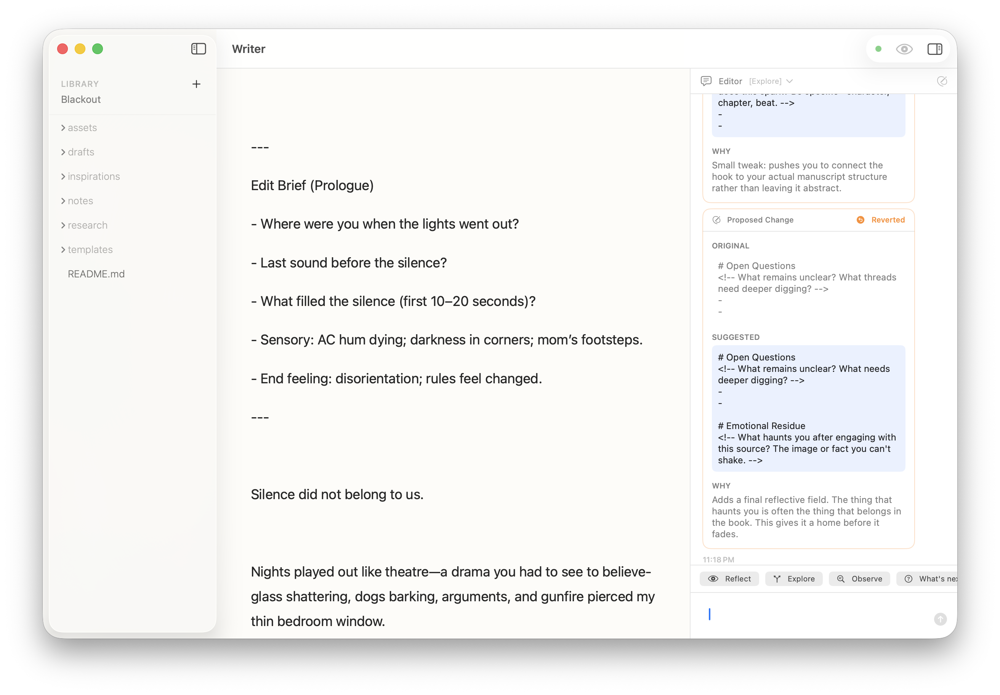

# copy-app

Capture any macOS application window to your clipboard with a single command. No clicking, no dragging, no window switching.

```bash
copy-app Safari
```



The window is captured directly from its compositing layer - even if it's hidden behind other windows.

## Installation

### Homebrew (recommended)

```bash
brew tap JordanCoin/tap
brew install copy-app
```

### Quick Install

```bash
curl -fsSL https://raw.githubusercontent.com/JordanCoin/copy-app/main/install.sh | bash
```

### Manual

```bash
git clone https://github.com/JordanCoin/copy-app.git
cd copy-app
./install.sh
```

## Usage

```bash
# Capture an app's frontmost window
copy-app Writer
copy-app Safari
copy-app Finder

# Filter by window title
copy-app Terminal -t "server-log"
copy-app Safari -t "GitHub"
```

## Auto-Save Screenshots

By default, screenshots are only copied to clipboard. To also save them to disk:

```bash
mkdir -p ~/.config/copy-app
echo 'SAVE_DIR=~/copyMac/screenshots' > ~/.config/copy-app/config
```

Screenshots are organized by app: `~/copyMac/screenshots/<AppName>/AppName_2024-01-15_14-30-45.png`

## Requirements

- **macOS 12+** (Monterey or later)
- **Xcode Command Line Tools** - for compiling the Swift helper on first run
  ```bash
  xcode-select --install
  ```

## Permissions

On first run, you'll need to grant **Accessibility** permission to your terminal app:

1. System Settings → Privacy & Security → Accessibility
2. Click `+` and add your terminal (Terminal.app, iTerm, Warp, etc.)
3. Restart your terminal

The script will automatically open System Settings if permission is missing.

## How It Works

1. A Swift helper queries `CGWindowListCopyWindowInfo` to find the window ID by app name
2. `screencapture -l <windowid>` captures the window's composited image directly
3. The image is copied to clipboard (and optionally saved to disk)

This captures the actual window content regardless of what's on top of it - no need to bring the window to front.

## Troubleshooting

**"No capturable window found"**
- Make sure the app is running and has at least one open window
- Check the exact app name (use `copy-app "Google Chrome"` for Chrome)

**"Failed to compile helper"**
- Install Xcode Command Line Tools: `xcode-select --install`

**Permission errors**
- Grant Accessibility permission to your terminal app
- Fully quit and restart your terminal after granting permission

## Claude Code Integration

Automatically screenshot apps when Claude launches them via xcodebuildmcp:

```bash
copy-app --install-hook    # Set up hook
copy-app --uninstall-hook  # Remove hook
```

This sets up a Claude Code hook so when xcodebuildmcp launches your app, copy-app captures a screenshot and Claude can view it with the Read tool.

Screenshots are organized by app: `~/copyMac/screenshots/<AppName>/`.

## License

MIT
